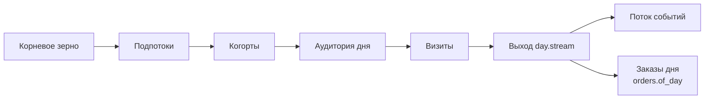

# Генератор кликстрима

Путеводитель показывает, как пройти генератор от корневого зерна до двух
выходов дня, не пересказывая код и спеки.

## Целевая картина одним взглядом

- **Подпоток определяется местом в дереве, а мир внутри подпотока — порядком
  бросков** — [дерево зерен и порядок бросков](seeds.md).
- **Мир поднимает только когорты окна, нужные запрошенному дню** —
  [ленивость мира](lazy-world.md).
- **Устройство и город принадлежат куке на всю жизнь и потому решаются
  планом состава** — [паспорт куки](cookie-passport.md).
- **Выбор по весам сведен к целым броскам и арифметике интервалов** —
  [целочисленная случайность](randomness.md).
- **Торговля получает готовые строки страниц и возвращает поток событий
  вместе с покупками для бэкенда** — [шов торговых событий](commerce-seam.md).
- **Сутки принадлежат поясу счетчика, а `UTCEventTime` остается абсолютной
  меткой** — [время модельного дня](counter-time.md).



За правой ветвью начинается отдельный набор документов —
[устройство заказов](../orders/README.md).

## Живой проход

Из каталога `generator/` одна команда собирает канонический D0 и показывает
все стадии на одном экране:

```sh
make demo
```

Когорту и аудиторию пример получает через открытый интерфейс плана, а визиты
считает группировкой выходных строк по `VisitID`. Код прохода —
[`demo.main`](../../../generator/src/clickstream_generator/demo.py).

## Родословная

Устройство генератора и основания решений записаны в [спеке этапа
2](../../specs/2026-08-01-generator.md), а границы двух источников и склейки —
в [мастер-спеке стенда](../../specs/2026-07-30-stand-v2-realism.md).
Основания трех решений записаны в
[ADR 0015](../../adr/0015-counter-timezone.md),
[ADR 0016](../../adr/0016-cookie-passport.md) и
[ADR 0017](../../adr/0017-order-numbering.md), а спека этапа 2 закрыта.
Путеводитель появился по тикету
[#48](https://git.dementev.space/ddmitry/clickstream-data-platform/issues/48):
он отвечает на другой вопрос — как пройти принятое устройство по коду.
