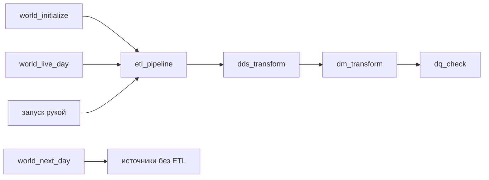

# Потоки Airflow и даги модельного времени

Airflow управляет генерацией данных и их обработкой в хранилище. Это разные
этапы: сначала в Kafka поступают события и заказы за день работы магазина,
затем по ним рассчитываются данные DDS и витрины DM.



## Два потока входят по-разному

События поступают в топик `hits` и обрабатываются по мере поступления:
материализованные представления переносят строки из STG в ODS без участия
Airflow.

Заказы поступают в топик `orders` раз в модельные сутки одной выгрузкой.
Она содержит состояние заказов на конец дня и называется слепком.
Даг `orders_ingest` загружает ее целиком. Такой способ приема называется
[пакетным](../../CONTEXT.md).

## Даги мира

В документации миром называется учебный магазин с его посетителями,
товарами и заказами. Время в нем идет отдельно от календарного.
Два дага с тегом «жизненный цикл мира» создают начальные данные:

| Даг | Что делает |
|---|---|
| `world_initialize` | Создает начальные данные, если их еще нет |
| `world_recreate` | Удаляет прикладные данные и создает их заново |

Для добавления следующих дней есть три дага с тегом «модельное время»:

| Даг | Что делает |
|---|---|
| `world_next_day` | Генерирует данные за следующие дни без пауз между событиями |
| `world_live_day` | Генерирует данные за следующий день постепенно, примерно за 24 минуты |
| `world_live` | Запускает `world_live_day` день за днем, пока снят с паузы |

В переменной Airflow `world_position` хранится номер следующего дня для
генерации. Например, при значении `8` генератор уже отправил события
за дни с 0 по 7.

`world_next_day` и `world_live_day` сначала отправляют события дня D,
затем — слепок заказов за предыдущий день D−1. Они ждут, пока `orders_ingest`
загрузит слепок, и только после успешного завершения дня обновляют
`world_position`. Если генерация или прием данных завершились с ошибкой,
номер дня остается прежним. Подробности — в [справочнике генератора
и модельного времени](../architecture/world.md#даги-модельного-времени).

## Дневной конвейер

Даг `etl_pipeline` по очереди запускает `dds_transform`, `dm_transform`
и `dq_check`, дожидаясь завершения каждого. Они рассчитывают данные DDS,
обновляют витрины DM и проверяют качество результата.

При запуске `etl_pipeline` не нужно указывать даты. Дни для обработки
определяются по `world_position` и по уже загруженным данным в слоях.
Детали есть в
[справочнике конвейера](../architecture/etl.md#объём-прогона).

После `world_next_day` новые события и заказы уже загружены, но данные DDS
и DM еще не пересчитаны: запустите `etl_pipeline` вручную.
`world_live_day` запускает его автоматически и ждет завершения. Поэтому
`world_live_day` может продолжать работу после окончания генерации за день.

## Если даг завершился с ошибкой

Ошибка в `etl_pipeline` не меняет `world_position`: генерация и прием
данных за день уже завершились. После устранения причины ошибки
перезапустите конвейер вручную. Даты для повторной обработки он определит сам.
Кто запускает конвейер, описано в
[разделе о трех путях запуска](../architecture/etl.md#три-пути-запуска).

За качество данных отвечают проверки DQ (Data Quality) в даге `dq_check`.
Если проверка находит расхождение, задача завершается с ошибкой и записывает
в журнал ключи строк, которые ее не прошли. Состав
проверок описан в [разделе «Звено DQ
конвейера»](../architecture/dm.md#звено-dq-конвейера).

## Как найти в интерфейсе

Даги мира ищите по тегам «модельное время» и «жизненный цикл мира». Остальные
даги ищите по тегам «заказы», `etl`, `dds`, `dm` и `dq`. `homework_check` с
тегами `dm` и `labs` проверяет домашние работы; о нем рассказано в учебных
заданиях.

## Посмотрите сами

Откройте Airflow по адресу из раздела [«Адреса и
пароли»](../../README.md#адреса-и-пароли). В Admin → Variables найдите
`world_position`. Затем запустите `world_next_day` на один день по [инструкции
из README](../../README.md#добавить-данные-за-следующие-дни). Убедитесь, что
`orders_ingest` завершился успешно, а в витринах нового дня еще нет.
Запустите `etl_pipeline` вручную и дождитесь его завершения.

В DBeaver, подключенном по
[инструкции](../../README.md#подключиться-из-dbeaver), выполните два запроса:

```sql
SELECT report_date, visitors, known_users
FROM dm.daily_traffic_v
ORDER BY report_date DESC
LIMIT 3;

SELECT report_date, sum(revenue) AS revenue
FROM dm.revenue_daily_v
GROUP BY report_date
ORDER BY report_date DESC
LIMIT 3;
```

В витрине трафика уже есть новый день, а в выручке последняя дата —
предыдущий день. Причина в выгрузке заказов: вместе с событиями дня D
приходит слепок за день D−1. Выручка дня D появится после генерации
дня D+1 и запуска конвейера.

## Куда дальше

Детали — в справочниках [конвейера](../architecture/etl.md) и
[мира](../architecture/world.md). Следующая глава — [«Мониторинг: куда
смотреть»](monitoring.md).
