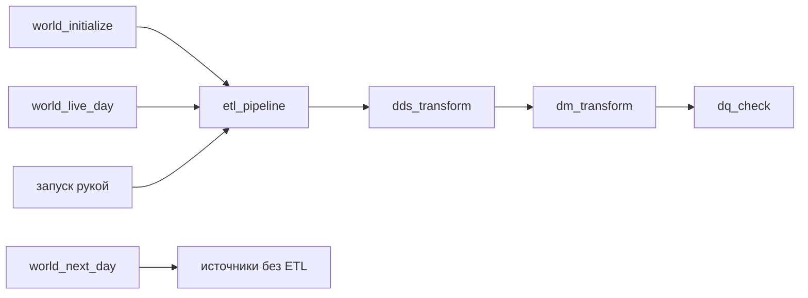

# Потоки Airflow и даги модельного времени

В Airflow два рода дагов. Даги мира создают мир и проигрывают модельные дни,
а дневной конвейер раскладывает сыгранный день по слоям хранилища.



## Два потока входят по-разному

События приходят в топик `hits`. Хранилище разбирает их само и непрерывно:
материализованные представления переносят строки из STG в ODS без участия
Airflow.

Заказы приходят в топик `orders` один раз в модельные сутки, целым слепком. У
слепка есть начало и конец, поэтому даг `orders_ingest` забирает его одной
порцией. Такой способ приема называется [пакетным](../../CONTEXT.md).

## Даги мира

Два дага с тегом «жизненный цикл мира» отвечают за стартовый мир:

| Даг | Что делает |
|---|---|
| `world_initialize` | Создает стартовый мир, если его еще нет |
| `world_recreate` | Стирает данные мира и собирает стартовый мир заново |

Три дага с тегом «модельное время» проигрывают следующие дни. Именно их
называют дагами модельного времени.

| Даг | Что делает |
|---|---|
| `world_next_day` | Играет следующие дни пачкой |
| `world_live_day` | Играет следующий день в темпе модельного времени |
| `world_live` | Запускает живые дни один за другим, пока снят с паузы |

Сколько дней уже сыграно, стенд помнит в переменной Airflow `world_position`:
в ней лежит номер первого несыгранного дня. `world_next_day` и `world_live_day`
записывают новое значение только после успешно сыгранного дня; оборванный
прогон его не меняет.

Сыграв день D, эти два дага отправляют слепок заказов за день D−1 и ждут, пока
`orders_ingest` его примет. Эти связи разобраны в [справочнике
мира](../architecture/world.md#даги-модельного-времени).

## Дневной конвейер

У `etl_pipeline` нет своей обработки. Он по очереди запускает `dds_transform`,
`dm_transform` и `dq_check` и ждет каждый даг. Параметров у него нет: сколько
дней обработать, он сам определяет по `world_position` и по тому, что уже лежит
в слоях. Поэтому один и тот же запуск верен и когда его запустил другой даг, и
когда вы нажали кнопку, и когда его повторяют после сбоя. Детали есть в
[справочнике конвейера](../architecture/etl.md#объём-прогона).

`world_next_day` не запускает конвейер. После него слои хранилища отстают от
мира, пока вы не запустите конвейер сами. `world_live_day`, наоборот,
запускает `etl_pipeline` и ждет его. Поэтому даг остается в работе и после
конца модельного дня.

## Что значит красный

Красный `etl_pipeline` не отменяет сыгранного дня: `world_position` уже
записана. Достаточно перезапустить конвейер рукой; разбираться, на чем
остановился прошлый прогон, не нужно. Кто запускает конвейер, описано в
[разделе о трех путях запуска](../architecture/etl.md#три-пути-запуска).

Качество данных проверяет контур DQ. В дневном конвейере это даг `dq_check`:
упавшая задача печатает в лог ключи строк, не прошедших проверку. Состав
проверок описан в [разделе «Звено DQ
конвейера»](../architecture/dm.md#звено-dq-конвейера).

## Как найти в интерфейсе

Даги мира ищите по тегам «модельное время» и «жизненный цикл мира». Остальные
даги ищите по тегам «заказы», `etl`, `dds`, `dm` и `dq`. `homework_check` с
тегами `dm` и `labs` проверяет домашние работы; о нем рассказано в учебных
заданиях.

## Посмотрите сами

Откройте Airflow по адресу из раздела [«Адреса и
пароли»](../../README.md#адреса-и-пароли). В Admin → Variables найдите
`world_position`. Затем запустите `world_next_day` на один день по [инструкции
из README](../../README.md#добавить-данные-за-следующие-дни). Убедитесь, что `orders_ingest`
отработал, а витрины еще ничего не получили. Запустите `etl_pipeline` рукой.

В DBeaver, подключенном по
[инструкции](../../README.md#подключиться-из-dbeaver), выполните два запроса:

```sql
SELECT report_date, visitors, known_users
FROM dm.daily_traffic_v
ORDER BY report_date DESC
LIMIT 3;

SELECT report_date, sum(revenue) AS revenue
FROM dm.revenue_daily_v
GROUP BY report_date
ORDER BY report_date DESC
LIMIT 3;
```

В трафике уже есть сыгранный день, а в выручке только предыдущий: вместе с этим
днем пришел слепок заказов за предыдущий. Выручка сыгранного дня появится после
следующего.

## Куда дальше

Детали — в справочниках [конвейера](../architecture/etl.md) и
[мира](../architecture/world.md). Следующая глава — [«Мониторинг: куда
смотреть»](monitoring.md).
