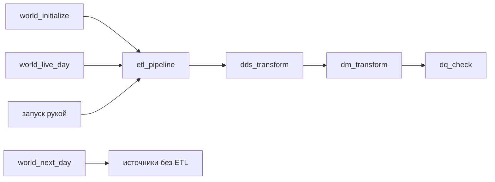

# Потоки Airflow и даги модельного времени

В Airflow есть два рода дагов. Даги модельного времени двигают мир вперед, а
дневной конвейер раскладывает прожитый день по слоям.



## Два потока входят по-разному

События приходят в топик `hits`. Хранилище разбирает их само и непрерывно:
материализованные представления переносят строки из STG в ODS без участия
Airflow.

Заказы приходят в топик `orders` слепком раз в модельные сутки. У слепка есть
начало и конец, поэтому даг `orders_ingest` забирает его целиком. Такой способ
приема называется [пакетным забором](../../CONTEXT.md).

## Даги мира

Два дага с тегом «жизненный цикл мира» создают мир:

| Даг | Что делает |
|---|---|
| `world_initialize` | Создает стартовый мир, если его еще нет |
| `world_recreate` | Удаляет только прикладной мир и создает его заново |

Три дага с тегом «модельное время» двигают ось. Дагами модельного времени
называют только их.

| Даг | Что делает |
|---|---|
| `world_next_day` | Играет следующие дни пачкой |
| `world_live_day` | Играет следующий день в темпе модельного времени |
| `world_live` | Запускает живые дни один за другим, пока снят с паузы |

Позиция мира — переменная Airflow `world_position`, номер первого несыгранного
дня. Шаговый даг ставит ее только после успешного дня: оборванный прогон позицию
не двигает.

Сыграв день D, шаговый даг отправляет слепок заказов дня D−1 и ждет
`orders_ingest`. Эти связи разобраны в [справочнике
мира](../architecture/world.md#даги-модельного-времени).

## Дневной конвейер

У `etl_pipeline` нет своей обработки. Он по очереди запускает `dds_transform`,
`dm_transform` и `dq_check` и ждет каждый даг. Параметров нет: объем работы
конвейер выводит из позиции мира и состояния слоев. Поэтому один и тот же запуск
верен и когда его запустил другой даг, и когда вы нажали кнопку, и когда его
повторяют после сбоя. Детали есть в [справочнике
конвейера](../architecture/etl.md#объём-прогона).

`world_next_day` не запускает конвейер. После пакетного шага слои догоняют мир
только по вашей команде. `world_live_day`, наоборот, запускает `etl_pipeline` и
ждет его. Поэтому даг остается в работе и после конца модельного дня.

## Что значит красный

Красный `etl_pipeline` не отменяет сыгранного дня: позиция уже записана. Чинится
он перезапуском рукой — помнить о прошлом прогоне ничего не нужно. Кто запускает
конвейер, описано в [разделе о трех путях
запуска](../architecture/etl.md#три-пути-запуска).

Контур DQ проверяет данные. В дневном конвейере это `dq_check`: красная задача
печатает нарушенные ключи. Состав проверок описан в [разделе «Звено DQ
конвейера»](../architecture/dm.md#звено-dq-конвейера).

## Как найти в интерфейсе

Даги мира ищите по тегам «модельное время» и «жизненный цикл мира». Остальные
даги ищите по тегам «заказы», `etl`, `dds`, `dm` и `dq`. `homework_check` с
тегами `dm` и `labs` проверяет домашние работы; о нем расскажут уроки.

## Посмотрите сами

Откройте Airflow по адресу из раздела [«Адреса и
пароли»](../../README.md#адреса-и-пароли). В Admin → Variables найдите
`world_position`. Затем запустите `world_next_day` на один день по [инструкции
из README](../../README.md#сдвинуть-мир-вперед). Убедитесь, что `orders_ingest`
отработал, а витрины еще ничего не получили. Запустите `etl_pipeline` рукой.

В DBeaver, подключенном по
[инструкции](../../README.md#подключиться-из-dbeaver), выполните два запроса:

```sql
SELECT report_date, visitors, known_users
FROM dm.daily_traffic_v
ORDER BY report_date DESC
LIMIT 3;

SELECT report_date, sum(revenue) AS revenue
FROM dm.revenue_daily_v
GROUP BY report_date
ORDER BY report_date DESC
LIMIT 3;
```

Трафик получил сыгранный день, а выручка — только предыдущий: с этим ходом
приехал слепок предыдущего дня. Сыгранный день получит выручку на следующем
ходу.

## Куда дальше

Детали — в справочниках [конвейера](../architecture/etl.md) и
[мира](../architecture/world.md). Следующая глава — [«Мониторинг: куда
смотреть»](monitoring.md).
