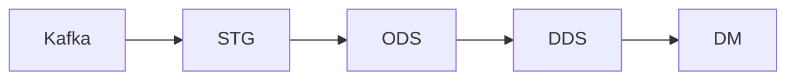

# Хранилище и его слои

В хранилище приходят два потока из Kafka: в топике `hits` — события
кликстрима, в `orders` — заказы магазина. Оба проходят один путь: STG → ODS →
DDS → DM. Каждый слой отвечает на свой вопрос.



## Как читать имена

Для обычного чтения выбирайте объекты с суффиксом `_v`. Это представления:
их устройство может поменяться, а ваш запрос останется прежним. Суффиксы
`_rep`, `_dist`, `_kafka` и `_mv` относятся к внутреннему
устройству хранилища. Они нужны для загрузки, обслуживания и диагностики.
У словарей есть исключение: у `dic.products` нет суффикса, потому что
различать нечего — объект один.
Подробный разбор имен есть в [справочнике
хранилища](../architecture/storage.md#имена-объектов).

## STG: как поступило

STG — сырой слой. Он сохраняет сообщение целой строкой, без разбора. Рядом
лежат метаданные доставки: топик, партиция, смещение и время приема. Поэтому в
STG можно увидеть, что именно приехало из Kafka, даже если сообщение
испорчено.

Срок хранения — трое суток реального времени. Этого хватает для расследования
и повторного разбора, но старые строки не занимают диск вечно. Точное правило
— в [справочнике
хранилища](../architecture/storage.md#срок-жизни-сырых-данных).

## ODS: язык источника

ODS — слой разобранных данных. Строка получает типы: дата становится датой,
число — числом. Имена полей остаются на языке источника. Например, событие
сохраняет колонки `WatchID`, `ClientID` и `EventDate`.

Испорченное сообщение не останавливает загрузку. Оно попадает в таблицу
`*_errors` вместе с сырой строкой и классом ошибки. Так брак остается виден, а
годные строки продолжают движение.

## DDS: язык бизнеса

DDS — детальный слой на языке бизнеса. Здесь есть событие, заказ, сессия и
карта идентичностей. Карта связывает посетителя, то есть куку `ClientID`, с
пользователем магазина из заказа.

Сессия не приходит готовой из Kafka. Стенд сам выделяет ее из последовательных
событий одного посетителя. Здесь собраны сущности, с которыми дальше работают
аналитики.

## DM: данные для дашбордов

DM — слой витрин. Витрина — готовый набор показателей для отчета или
дашборда. Здесь уже посчитаны, например, дневная выручка по категориям и
дневные показатели трафика.

К каждой витрине можно обращаться коротким запросом, не повторяя в нем весь
путь расчета. Состав готовых витрин смотрите в [карте
таблиц](../architecture/storage.md#карта-таблиц).

## Сбоку цепочки: зона `dic`

Зона `dic` стоит вне пути STG → ODS → DDS → DM. В ней живут справочные данные,
которые хранилище получает готовыми. Ни один слой их не производит, а читать
может любой.

Первый справочник стенда — каталог товаров `dic.products`. Его ключ `sku` —
артикул товара. По нему можно узнать название, бренд и категорию товара. Как
устроена зона, смотрите в [разделе о
справочниках](../architecture/storage.md#справочники).

## Сквозные ключи

Один и тот же смысл проходит через слои под разными именами: имя меняется
вместе с языком слоя. Таблица показывает исходное имя и то, где искать тот же
смысл дальше.

| Колонка | Что означает | Что соединяет |
|---|---|---|
| `WatchID` | Идентификатор события | Событие ODS с событием DDS, где колонка называется `event_id` |
| `ClientID` | Посетитель, то есть кука | События ODS с событиями, сессиями и картой идентичностей DDS; в DDS колонка называется `client_id` |
| `order_id` | Идентификатор заказа | Заказ ODS с заказом DDS и витриной сверки `dm.purchase_vs_orders_v` |
| `sku` | Артикул товара в каталоге | Справочник `dic.products` с позициями заказа DDS, где артикулы лежат в `item_sku`; через категорию товара — с витриной выручки DM |
| `EventDate` | День на [оси модельного времени](../../CONTEXT.md), который счетчик сайта проставляет в [своем часовом поясе](../architecture/storage.md#часовые-пояса) | Событие ODS с событием DDS, где колонка называется `event_date`, и дневными расчетами DM |

Что здесь значит «посетитель» и чем кука отличается от человека, объясняет
[словарь понятий](../../CONTEXT.md#язык). Точные имена объектов и полей сверяйте с
[картой таблиц](../architecture/storage.md#карта-таблиц).

## Посмотрите сами

Подключитесь к ClickHouse по инструкции из разделов [«Адреса и
пароли»](../../README.md#адреса-и-пароли) и [«Подключиться из
DBeaver»](../../README.md#подключиться-из-dbeaver). В обоих примерах
`2026-06-01` — это D0, первый день [стартового
мира](../../CONTEXT.md). Чтобы посмотреть другой день, замените
эту дату в условии. Первый запрос покажет
события одного модельного дня:

```sql
SELECT
    WatchID,
    ClientID,
    EventDate,
    EventType,
    URL
FROM ods.event_v
WHERE EventDate = '2026-06-01'
ORDER BY UTCEventTime
LIMIT 20;
```

Второй запрос покажет готовую выручку по категориям за тот же день:

```sql
SELECT
    product_category,
    orders,
    units,
    revenue
FROM dm.revenue_daily_v
WHERE report_date = '2026-06-01'
ORDER BY revenue DESC;
```

Оба запроса читают поверхности `_v`. Первый показывает данные на языке
источника, второй — готовый ответ витрины.

## Куда дальше

Список объектов, сроки хранения и устройство таблиц — в [справочнике
хранилища](../architecture/storage.md). Как данные переносят между слоями — в
следующей главе: [потоки Airflow и даги модельного
времени](README.md#потоки-airflow-и-даги-модельного-времени).
