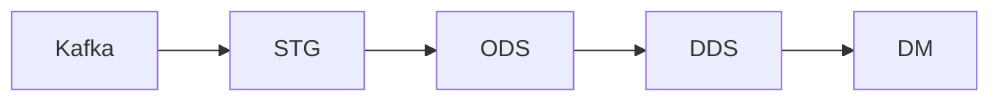

# Хранилище и его слои

В хранилище приходят два потока из Kafka: в топике `hits` — события
кликстрима, в `orders` — заказы магазина. Оба проходят один путь: STG → ODS →
DDS → DM. В STG сообщения сохраняются как есть, в ODS разбираются по полям,
в DDS из них собираются события, заказы и сессии, а в DM — витрины для отчетов.



## Как читать имена

Для обычного чтения выбирайте представления с суффиксом `_v`. Они позволяют
менять устройство таблиц, сохраняя привычные запросы к данным.
Суффиксы `_rep`, `_dist`, `_kafka` и `_mv` относятся к внутреннему устройству
хранилища. Эти объекты нужны для загрузки, обслуживания и диагностики.
У словаря товаров `dic.products` суффикса нет.
Подробный разбор имен есть в [справочнике
хранилища](../architecture/storage.md#имена-объектов).

## STG: как поступило

STG — сырой слой. Он сохраняет сообщение целой строкой, без разбора. Вместе
с ним записываются сведения о доставке: топик, партиция, смещение и время
приема. Содержимое сообщения сохраняется в STG, даже если в нем есть ошибки.

Сырые сообщения хранятся трое суток реального времени. В течение этого срока
их можно использовать для поиска ошибок и повторной обработки. Затем они
удаляются по правилу из [справочника
хранилища](../architecture/storage.md#срок-жизни-сырых-данных).

## ODS: язык источника

В ODS содержимое сообщения разбирается на колонки с нужными типами данных:
датами, числами, строками. Колонки сохраняют имена из источника. Например,
в таблице событий есть `WatchID`, `ClientID` и `EventDate`.

Испорченное сообщение не останавливает загрузку. Оно попадает в таблицу
`*_errors` вместе с исходной строкой и классом ошибки. Правильно записанные
сообщения обрабатываются дальше.

## DDS: язык бизнеса

DDS — детальный слой: в нем данные подготовлены для анализа событий,
заказов и сессий. Здесь же хранится карта идентичностей — таблица связей
между идентификатором посетителя `ClientID` и пользователем магазина
из заказа. `ClientID` хранится в cookie браузера: по нему можно узнать
браузер посетителя, но не всегда самого человека.

В стенде визитом, или сессией, считают подряд идущие события одного
`ClientID` без пауз дольше 30 минут. Визит не пересекает границу модельных суток.

Источник передает готовый идентификатор визита `VisitID` по образцу
Яндекс Метрики. В учебном хранилище сессии рассчитываются заново по времени
событий; каждой присваивается `session_id`. Поле `VisitID` остается
эталоном для проверки. Так в заданиях вы сможете самостоятельно определить
границы сессий и сравнить их с результатом источника.

Готовые сессии читайте через `dds.session_v`. События для самостоятельного
расчета доступны в `dds.event_v`: в этом представлении `VisitID` скрыт.

## DM: данные для дашбордов

DM — слой витрин. Витрина — готовый набор показателей для отчета или
дашборда. Здесь уже посчитаны, например, дневная выручка по категориям и
дневные показатели трафика.

К каждой витрине можно обращаться коротким запросом, не повторяя в нем весь
путь расчета. Состав готовых витрин смотрите в [карте
таблиц](../architecture/storage.md#карта-таблиц).

## Справочные данные: зона `dic`

В базе `dic` хранятся готовые справочные данные. Они загружаются отдельно
от событий и заказов и могут использоваться в расчетах любого слоя.

Каталог товаров `dic.products` — один из таких справочников. Его ключ `sku` —
артикул товара. По нему можно узнать название, бренд и категорию товара. Как
устроена зона, смотрите в [разделе о
справочниках](../architecture/storage.md#справочники).

## Сквозные ключи

Идентификаторы позволяют связать данные из разных слоев. При переходе в DDS
часть колонок переименовывается: например, `WatchID` становится `event_id`.
В таблице указано, как найти соответствующие колонки и соединить по ним данные.

| Колонка | Что означает | Что соединяет |
|---|---|---|
| `WatchID` | Идентификатор события | Событие ODS с событием DDS, где колонка называется `event_id` |
| `ClientID` | Идентификатор посетителя из cookie браузера | События ODS с событиями, сессиями и картой идентичностей DDS; в DDS колонка называется `client_id` |
| `order_id` | Идентификатор заказа | Заказ ODS с заказом DDS и витриной сверки `dm.purchase_vs_orders_v` |
| `sku` | Артикул товара в каталоге | Справочник `dic.products` с позициями заказа DDS, где артикулы лежат в `item_sku`; через категорию товара — с витриной выручки DM |
| `EventDate` | Дата события в [модельном времени](../../CONTEXT.md), указанная счетчиком сайта в [его часовом поясе](../architecture/storage.md#часовые-пояса) | Событие ODS с событием DDS, где колонка называется `event_date`, и дневными расчетами DM |

Почему идентификатор посетителя не равнозначен человеку, объясняет
[словарь понятий](../../CONTEXT.md#язык). Точные имена объектов и полей сверяйте с
[картой таблиц](../architecture/storage.md#карта-таблиц).

## Посмотрите сами

Подключитесь к ClickHouse по инструкции из разделов [«Адреса и
пароли»](../../README.md#адреса-и-пароли) и [«Подключиться из
DBeaver»](../../README.md#подключиться-из-dbeaver). Во всех трех примерах
`2026-06-01` — первый день работы учебного магазина. В документации он
обозначается D0; подробнее — в [словаре понятий](../../CONTEXT.md).
Чтобы посмотреть другой день, замените дату в условии.
Первый запрос покажет 20 событий за выбранный день:

```sql
SELECT
    WatchID,
    ClientID,
    EventDate,
    EventType,
    URL
FROM ods.event_v
WHERE EventDate = '2026-06-01'
ORDER BY UTCEventTime
LIMIT 20;
```

Второй запрос покажет 20 сессий того же дня с наибольшим числом событий.
Сессии рассчитаны по всем событиям дня:

```sql
SELECT
    client_id,
    started_at,
    finished_at,
    events_total,
    pageviews,
    purchases,
    entry_url
FROM dds.session_v
WHERE session_date = '2026-06-01'
ORDER BY events_total DESC
LIMIT 20;
```

Третий запрос покажет готовую выручку по категориям за тот же день:

```sql
SELECT
    product_category,
    orders,
    units,
    revenue
FROM dm.revenue_daily_v
WHERE report_date = '2026-06-01'
ORDER BY revenue DESC;
```

Все три запроса читают представления `_v`.

## Куда дальше

Откройте [интерактивную карту](architecture-map.html) из своей копии
репозитория и проследите путь данных.
Список объектов, сроки хранения и устройство таблиц — в [справочнике
хранилища](../architecture/storage.md). Как данные обрабатываются между слоями — в
следующей главе: [потоки Airflow и даги модельного
времени](airflow-dags.md).
